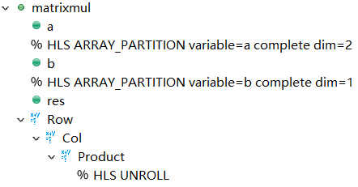
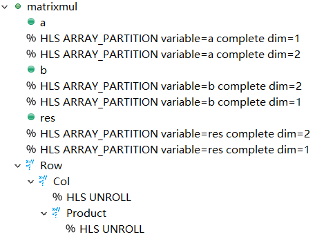
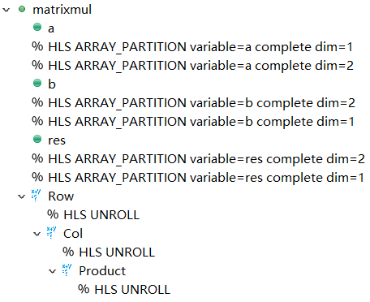
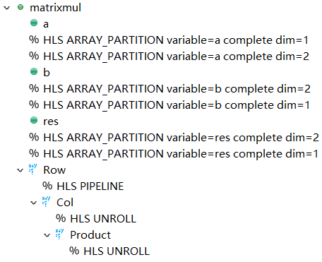
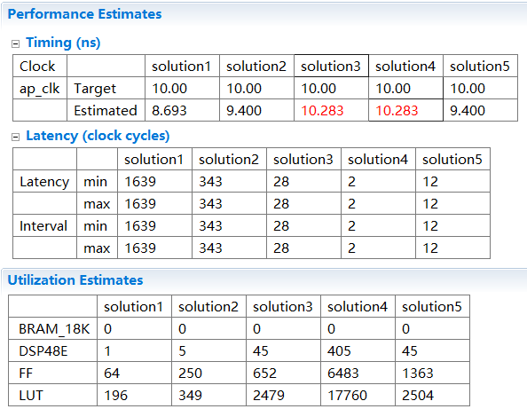
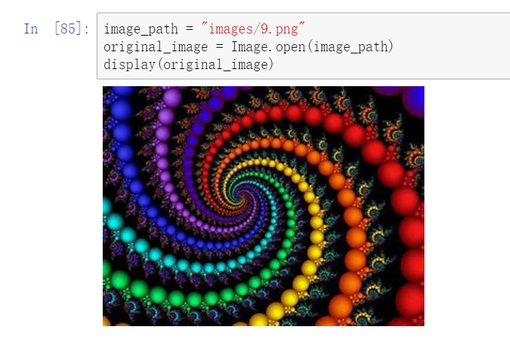
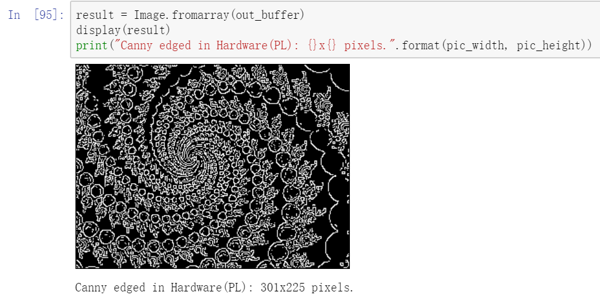
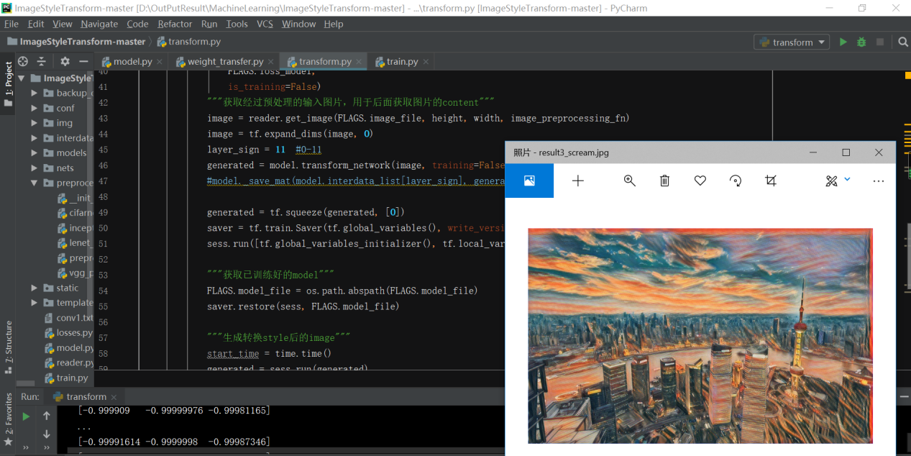

本周所做的工作：
***
1.Xilinx暑期学校：
* HLS基础实验：循环展开、数据分割和接口定义对硬件性能的不同效果。
Solution1:无
Solution2:给a、b两个参数施加Array Partition，并在product步骤实施Unroll

Solution3:对a、b、res实施两个维度上的array_partition，并对Col循环、Product循环进行展开。

Solution4:在Solution3的基础上，再对Row循环进行展开。

Solution5:将Solution4中的Row循环变为流水线展开。

* HLS综合实验：矩阵乘法加速和Canny图像边缘识别算法加速。
原图

结果图

* 大PJ：图像风格迁移
（原理图）
已可在PC上运行inference阶段的风格迁移程序。

风格图

原图

效果图

原计划在PYNQ-Z1上进行部署，但后来发现网络规模较大，拟转至ZCU-102或u280卡上实现。另外，生成网络含三个卷积层、五个残差网络层和三个反卷积层，其中卷积层中包含BN（归一化网络），对FPGA的实现不够友好。
暂时还无法更换风格，如要更换风格，需要更换风格图片进行重训练。

2.安卓人脸识别项目：
正在阅读源码并调试，参考
<u>https://github.com/ageitgey/face_recognition/blob/master/README_Simplified_Chinese.md（face_recognition开源项目）
https://github.com/pythondever/face-recognition，https://zhuanlan.zhihu.com/p/24567586，https://blog.csdn.net/lucky404/article/details/88184350。
</u>
