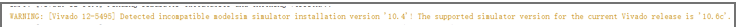
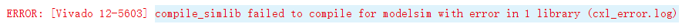
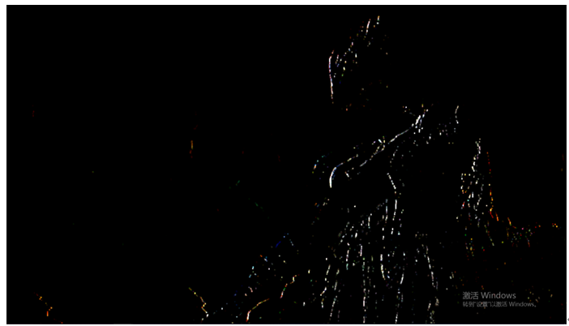
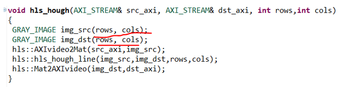
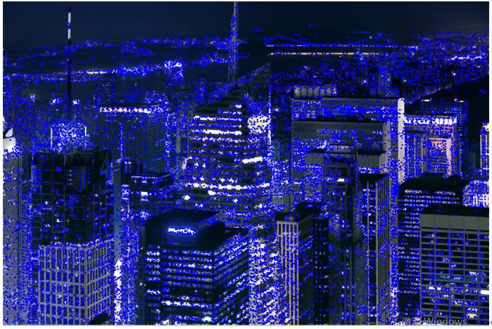

# 基于HLS简单算法的实现
以“米联客”系列教程为基础
环境配置问题：
1.一开始进行GUI编译仿真库的时候，要注意Vivado对modelsim的版本是有要求的。（UG973）

2.破解modelsim要在系统变量与用户变量都加上license，且名字都为MGLS_LICENSE_FILE。
3.预编译库时报错

Xilinx官网查了不影响别的IP的编译
Tcl编译也出现一样的错误
## ch02 shift LED
|    |Int |AP_8.8|
|:---|:---|:--- |
|FF  |93  |45   |
|LUT |144 |144  |
编译逻辑成功
## cH03 ImageLoad 实验
```
添加声明typedef hls::stream<ap_axiu<1024,1,1,1>> AXI_STREAM;
```
语法正确 不能综合，可以仿真
<u>*参考：UG871，UG902, PP4fpga这本书UG871，UG902, PP4fpga*</u>
方法二：cvLoadImage函数加载图片编译成功
方法三：读取视频文件  未测试
方法四：摄像头操作 未测试

## ch04 Skin_Dection
教程没有top.h文件，自行添加

## CH05 Sobel 算子硬件实现
原图与仿真结果:

例程代码与通过 OPENCV 实现的 Sobel 检测结果基本一致

## ch07 Hough

综合时出错
```
***** with default size is used in a non-dataflow region, which may result in deadlock. Please consider to resize the stream using the directive ‘set_directive_stream’ or the ‘HLS stream’ pragma.
ERROR: [HLS 200-70] Pre-synthesis failed.
```
<u>修正：对应变量添加directive，类型为Stream，最大深度设置为64（只用了58）
仿真时出错：没有语法错误，输出窗口直接关闭，提示的错误信息：</u>
```
@E Simulation failed: SIGSEGV.
ERROR: [SIM 211-100] CSim failed with errors.
```

## ch09 OTSU自适应二值化
可以综合
仿真时出错：
<u>显示的是黑屏
应该是逻辑有问题，还在修正</u>

## ch11 快速角点检测
正常编译：
原图 

结果图

